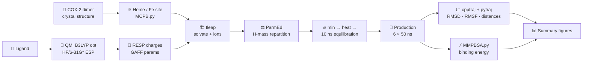
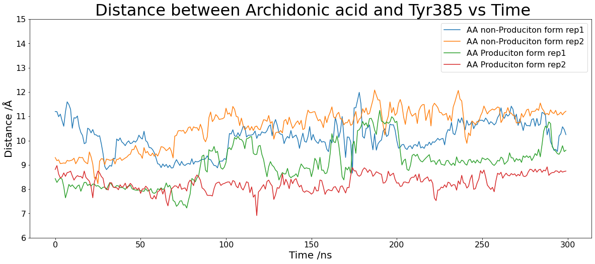
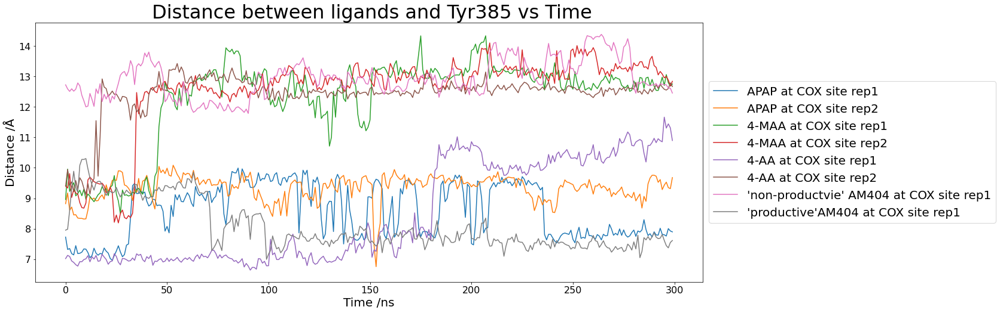

<div align="center">

# 🧬 COX-2 Molecular Dynamics

### How paracetamol, dipyrone metabolites and arachidonic acid interact with the two active sites of cyclooxygenase-2

[](https://ambermd.org/)
[](https://ambermd.org/AmberTools.php)
[](https://gaussian.com/)
<br>
[](https://www.python.org/)
[](https://amber-md.github.io/pytraj/)
[](https://jupyter.org/)

**MRes research project** · all-atom MD of the COX-2 homodimer

[Overview](#-overview) •
[Systems](#-systems) •
[Workflow](#-workflow) •
[Results](#-selected-results) •
[Quick start](#-quick-start) •
[Layout](#-repository-layout) •
[Reading](#-further-reading)

</div>

---

## 🔭 Overview

Cyclooxygenase-2 (COX-2) is a homodimer, and each monomer has **two catalytic sites**:

<table>
<tr>
<td width="50%" valign="top">

### 🔴 COX site
The **cyclooxygenase channel**, where the substrate arachidonic acid binds and **Tyr385** starts catalysis. Classical NSAIDs and coxibs such as rofecoxib block this site.

</td>
<td width="50%" valign="top">

### 🟢 POX site
The **peroxidase site** at the **heme**. One proposed mechanism is that paracetamol and dipyrone metabolites act here as reducing co-substrates rather than blocking the channel.

</td>
</tr>
</table>

This project uses all-atom molecular dynamics to test where these drugs sit and what they do to the enzyme. For every system it compares:

| 📏 Binding stability | 🌀 Protein dynamics | 🔗 Allostery | ⚡ Energetics |
|:---:|:---:|:---:|:---:|
| distance to Tyr385 or the heme iron | RMSD · RMSF · radius of gyration | residue correlation × contact networks between monomers | MM/PBSA and MM/GBSA binding energies |

### At a glance

| | |
|---|---|
| **Ligands** | 6: two references and four analgesics/metabolites |
| **Binding sites** | COX site, POX site, and both at once (`1C_2P`) |
| **Sampling** | 300 ns per replica, 2–3 replicas per system |
| **Force field** | ff19SB · GAFF + RESP · MCPB.py heme/Fe model |
| **Solvent** | OPC or TIP3P water, Na⁺/Cl⁻ |
| **Time step** | 4 fs with hydrogen mass repartitioning |

---

## 💊 Systems

| | Ligand | What it is | Role in this study |
|:---:|---|---|---|
| 🧪 | **AA**: arachidonic acid | Natural COX-2 substrate | Reference. Productive (tail-up) and non-productive (head-up) poses |
| 🛑 | **Vioxx**: rofecoxib | Selective COX-2 inhibitor | Reference for a COX-site blocker |
| 💊 | **APAP**: paracetamol | Analgesic / antipyretic | COX site and POX site |
| 🔁 | **AM404**: *N*-arachidonoylphenolamine | Paracetamol metabolite | COX site and POX site |
| 💉 | **MAA**: 4-methylaminoantipyrine | Active metabolite of dipyrone | COX site and POX site |
| 🔁 | **4-AA**: 4-aminoantipyrine | Metabolite of dipyrone | COX site and POX site |

> [!TIP]
> **Naming convention:** `MAA_POX` means MAA at the POX site. `1C_2P` systems have two copies of the ligand, one in a COX site and one at a POX site. `rep2`/`rep3` are independent replicas.

---

## 🧭 Workflow



| Step | Stage | Details | Folder |
|:---:|---|---|---|
| 1 | **Ligand parameters** | Gaussian optimisation → RESP charges → GAFF (`antechamber`, `parmchk2`) | [`01_ligand_parameterisation`](01_ligand_parameterisation) |
| 2 | **System setup** | ff19SB protein + MCPB.py heme/Fe + docked ligand, solvated in tleap, HMR with ParmEd | [`02_system_setup`](02_system_setup) |
| 3 | **Minimisation** | 10 000 steps restrained, then 16 000 unrestrained | [`03_md_protocol`](03_md_protocol) |
| 4 | **Heating** | 0 → 100 K (NVT), then 100 → 320 → 300 K (NPT), restrained | [`03_md_protocol`](03_md_protocol) |
| 5 | **Equilibration** | 10 ns, 300 K, NPT, Monte Carlo barostat | [`03_md_protocol`](03_md_protocol) |
| 6 | **Production** | 50 ns segments (300 ns per replica), frames every 50 ps | [`03_md_protocol`](03_md_protocol) |
| 7 | **Analysis** | cpptraj stripping, pytraj notebooks, MMPBSA.py array jobs | [`04_analysis`](04_analysis) · [`05_project_summary`](05_project_summary) |

---

## 📊 Selected results

Two figures from the project's summary notebooks, as saved from the original run (legends kept as originally produced).

<table>
<tr>
<td width="50%" align="center">

**Arachidonic acid reference poses**



<sub>The productive (tail-up) pose stays closer to Tyr385 than the non-productive (head-up) pose.<br>From <a href="05_project_summary/Vioxx_AA_npAA.ipynb"><code>Vioxx_AA_npAA.ipynb</code></a>.</sub>

</td>
<td width="50%" align="center">

**Drugs and metabolites in the COX site**



<sub>Ligand–Tyr385 distance for APAP, 4-MAA, 4-AA and AM404, 1 ns averages.<br>From <a href="05_project_summary/COX_oneligand.ipynb"><code>COX_oneligand.ipynb</code></a>.</sub>

</td>
</tr>
</table>

More figures (RMSD/Rg joint plots, RMSF profiles, MM/PBSA traces) are saved in the notebooks under [`04_analysis`](04_analysis) and [`05_project_summary`](05_project_summary).

> [!WARNING]
> **Corrections to the original project.** Check these before reusing figures from the original work:
> - 🔥 **Heating protocol:** `Heat_2.in` never ran its final 320 → 300 K ramp because of an extra `&wt type='END'` ([details](03_md_protocol/README.md#changes-from-the-original-scripts)). Now fixed.
> - 📉 **POX-site figure:** in `05_project_summary/POX_site.ipynb`, the two AM404 lines of the ligand–heme distance plot were drawn from 4-AA data. The code is fixed; re-run the notebook to regenerate the figure.
> - ⚡ **MM/PBSA units:** two notebooks labelled the energies kJ/mol; MMPBSA.py reports kcal/mol.
> - 📐 **RMSF subplots:** the summary notebooks had the x and y axis labels swapped.

---

## 🚀 Quick start

```bash
# 1. Environment (AmberTools, pytraj, Jupyter, ...)
conda env create -f environment.yml
conda activate cox2-md

# 2. Build a system (example: paracetamol at the POX site)
cd 02_system_setup/APAP_POX
tleap -f APAP_POX.in
parmed -p APAP_POX.parm7 -i ../hmr.parmed      # set outparm to APAP_POX_HMR.parm7

# 3. Simulate on a local GPU: NAME, last solute residue, GPU id
../../03_md_protocol/run_equilibration.sh APAP_POX 1107 0
../../03_md_protocol/run_production.sh    APAP_POX 6 0   # 6 × 50 ns = 300 ns
```

<details>
<summary><b>🖥️ Running on a PBS cluster instead</b></summary>

```bash
# Equilibration
qsub -v NAME=APAP_POX,RESNUM=1107,PROTOCOL_DIR=/path/to/03_md_protocol \
     /path/to/03_md_protocol/hpc/equilibration.pbs

# Production: a self-resubmitting chain, one 50 ns segment per job
python /path/to/03_md_protocol/hpc/next_job.py APAP_POX 1 0 --init --nseg 6

# MM/PBSA over 6000 frames split into 200 array tasks
qsub -J 1-200 -v JOB=APAP_POX,CHUNK=30 04_analysis/mmpbsa/mmpbsa_array.pbs
```

See [`03_md_protocol/README.md`](03_md_protocol/README.md) for details.
</details>

> [!NOTE]
> pmemd.cuda is licensed separately from AmberTools. Amber changes between releases, so check the [current manual](https://ambermd.org/Manuals.php) and [tutorials](https://ambermd.org/tutorials/) before reusing the inputs.

---

## 📁 Repository layout

The folders follow the order of the workflow. Each one has its own README.

```
📦 MRes_Project_COX-2
├── 📂 01_ligand_parameterisation   QM optimisation, RESP charges, GAFF parameters per ligand
├── 📂 02_system_setup              tleap scripts: protein + heme (MCPB.py) + ligand → solvated system
│   ├── common/                     shared COX-2 model and heme/Fe parameters
│   └── AA_COX/ APAP_COX/ APAP_POX/ MAA_POX/
├── 📂 03_md_protocol               pmemd inputs + run scripts (local GPU and PBS)
├── 📂 04_analysis
│   ├── trajectory/                 per-system pytraj notebooks + cpptraj/parmed inputs
│   └── mmpbsa/                     MMPBSA.py input, PBS array script, result notebooks
├── 📂 05_project_summary           cross-system comparison notebooks (main figures)
├── 📂 docs/figures                 figures shown in this README
└── 📄 environment.yml              conda environment for the analysis
```

> [!IMPORTANT]
> Trajectories and topologies (`.nc`, `.parm7`, …) are too large for git and are not included. The notebooks are kept **with their outputs** so the results can still be viewed. Each notebook opens with a header describing the system and any corrections made since its outputs were produced.

---

## 🛠️ Software

| Tool | Used for |
|---|---|
| [**Amber / AmberTools**](https://ambermd.org/) | `tleap`, `antechamber`, `parmchk2`, `MCPB.py`, `ParmEd`, `pmemd.cuda`, `cpptraj`, `MMPBSA.py` |
| **Gaussian 16 / GaussView** | Ligand geometry optimisation and electrostatic potential |
| **Python** | `pytraj`, `NumPy`, `SciPy`, `pandas`, `Matplotlib`, `seaborn`, Jupyter |

---

## 📚 Further reading

<details open>
<summary><b>🧬 COX-2 review</b></summary>

- [Chem. Rev., doi:10.1021/acs.chemrev.0c00215](https://pubs.acs.org/doi/10.1021/acs.chemrev.0c00215): a comprehensive starting point

</details>

<details>
<summary><b>🔗 Allostery in COX-2</b></summary>

- [PNAS, doi:10.1073/pnas.1507307112](https://www.pnas.org/doi/10.1073/pnas.1507307112)
- [J. Biol. Chem., doi:10.1074/jbc.M113.505503](https://doi.org/10.1074/jbc.M113.505503)
- [J. Biol. Chem., doi:10.1074/jbc.M116.757310](https://doi.org/10.1074/jbc.M116.757310)
- [J. Biol. Chem., doi:10.1074/jbc.TM118.006295](https://doi.org/10.1074/jbc.TM118.006295)

</details>

<details>
<summary><b>💉 Dipyrone (metamizole)</b></summary>

- [doi:10.1002/jcph.1512](https://doi.org/10.1002/jcph.1512)
- [doi:10.1038/sj.bjp.0707239](https://doi.org/10.1038/sj.bjp.0707239)

</details>

<details>
<summary><b>💊 Mechanism of paracetamol</b></summary>

- [doi:10.1016/j.clpt.2005.09.009](https://doi.org/10.1016/j.clpt.2005.09.009)
- [doi:10.1007/s10787-013-0172-x](https://link.springer.com/article/10.1007/s10787-013-0172-x)
- [doi:10.1111/1440-1681.13392](https://doi.org/10.1111/1440-1681.13392)

</details>

<details>
<summary><b>⚛️ Amber MD</b></summary>

- [Amber manuals](https://ambermd.org/Manuals.php) · [Tutorials](https://ambermd.org/tutorials/) · [AmberTools](https://ambermd.org/AmberTools.php)

</details>

---

<div align="center">
<sub>MRes project · molecular dynamics of cyclooxygenase-2</sub>
</div>
